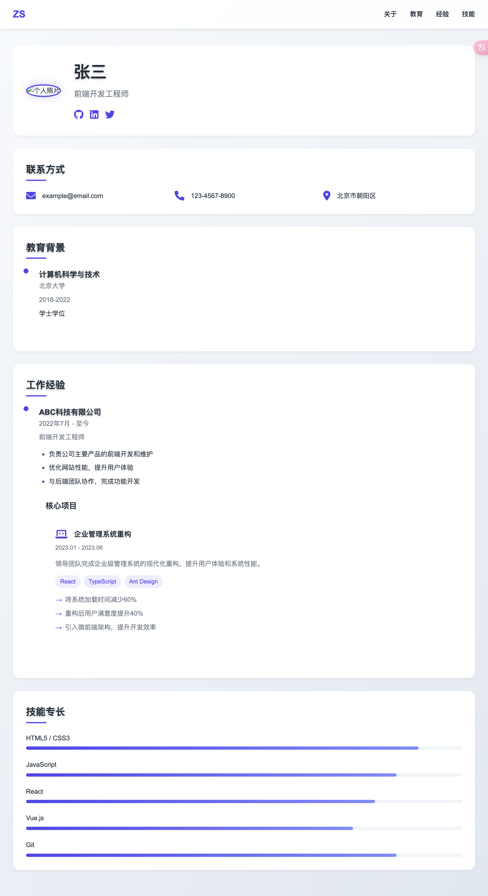

# 个人简历网站

一个简洁现代的个人简历网站模板，采用响应式设计，支持移动端和桌面端显示。

## 预览



## 特点

- 🎨 现代简约的设计风格
- 📱 完全响应式布局
- 🌓 清晰的视觉层次
- ⚡ 流畅的动画效果
- 🎯 突出展示项目经验
- 📊 技能进度条可视化
- 🔗 社交媒体链接整合
- 📝 清晰的时间轴展示

## 技术栈

- HTML5
- CSS3
- Font Awesome 图标

## 快速开始

1. 克隆仓库：
```bash
git clone https://github.com/yourusername/resume-template.git
```

2. 打开 `index.html` 文件进行预览

3. 根据需要修改内容：
   - 编辑 `index.html` 更新个人信息
   - 调整 `styles.css` 自定义样式

## 自定义指南

### 修改个人信息

在 `index.html` 中更新以下部分：

- 个人照片
- 姓名和职位
- 联系方式
- 教育背景
- 工作经验
- 项目经验
- 技能评分

### 更改配色方案

在 `styles.css` 中修改根变量：

```css
:root {
    --primary-color: #4f46e5;    /* 主色调 */
    --secondary-color: #818cf8;  /* 次要色调 */
    --text-color: #1f2937;      /* 主要文字颜色 */
    --light-text: #6b7280;      /* 次要文字颜色 */
    --background: #f8fafc;      /* 背景色 */
    --card-background: #ffffff; /* 卡片背景色 */
}
```

### 添加新的项目经验

在 `index.html` 中的 `.project-grid` 部分添加新的项目卡片：

```html
<div class="project-card">
    <div class="project-header">
        <i class="fas fa-laptop-code"></i>
        <h5>项目名称</h5>
    </div>
    <p class="project-duration">项目时间</p>
    <div class="project-content">
        <p class="project-desc">项目描述</p>
        <div class="project-tech">
            <span>技术1</span>
            <span>技术2</span>
        </div>
        <ul class="project-achievements">
            <li>成就1</li>
            <li>成就2</li>
        </ul>
    </div>
</div>
```

## 响应式设计

- 桌面端：完整显示所有内容
- 平板端：适当调整布局
- 移动端：
  - 隐藏导航菜单
  - 垂直堆叠内容
  - 优化阅读体验

## 浏览器支持

- Chrome (推荐)
- Firefox
- Safari
- Edge
- Opera

## 贡献

欢迎提交 Issue 和 Pull Request 来改进这个模板。

## 许可

MIT License - 详见 [LICENSE](LICENSE) 文件

## 作者

[您的名字]

---

如果觉得这个模板对您有帮助，欢迎给个 Star ⭐️
